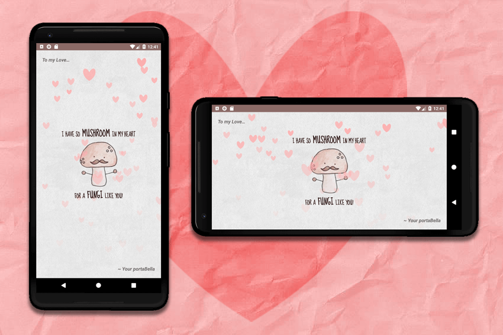

# Valentine Card

**Created for the *Grow with Google Challenge Scholarship:* Android Basics Course**

Full [video tutorial](https://www.youtube.com/watch?v=VrgKaYH3XLw) available on YouTube.

Used **API 23: Android 6.0 (Marshmallow)** to allow for custom fonts and falling hearts.

## Screenshots From the App:

### Portrait & Landscape

## Mini Explanation & Tutorial

1. A RelativeLayout parent view contains LinearLayout child views to achieve the most responsive result when going from portrait to landscape mode:
* The **RelativeLayout** is used to perfectly center the mushroom image to any screen size, horizontally or vertically, and anchors a text view right above and right below it. The RelativeLayout also allows for the greeting and signoff to appear at the top left and bottom right of the screen.
* The TextViews above and below the mushroom image are achieved using **LinearLayout in horizontal mode** so the words can be stacked next to each other. They are grouped: "I have so" + "MUSHROOM" + "in my heart"... so that 'mushroom' can have a larger font size. Similarly with 'FUNGI'.

2. **Custom Google Font:** [Sue Ellen Fransisco](https://fonts.google.com/specimen/Sue+Ellen+Francisco)
[How to use custom fonts in Android Studio](https://www.youtube.com/watch?v=TfB-TsLFJdM)

3. **Falling Hearts:**
I modified **[JetradarMobile](https://github.com/JetradarMobile)/[android-snowfall](https://github.com/JetradarMobile/android-snowfall)** to use a heart png with a transparent background instead of a snowflake. I customised the speed, number and size of the heart. If you get stuck, this [YouTube video](https://www.youtube.com/watch?v=nKw9GY4mlpg) I found will step you through the process.

**Full [video tutorial](https://www.youtube.com/watch?v=VrgKaYH3XLw) available on YouTube:**

 &nbsp;&nbsp;&nbsp;&nbsp;&nbsp; 

### Shoutout
Many thanks to **thr0w** for his tutorial [How to set up Android Studio with Github](https://discussions.udacity.com/t/how-to-set-up-android-studio-with-github-courses/203518), and **nick** for the idea to use android-snowfall like he did on his [class project](https://andbeg-googlescholar.slack.com/messages/C8J4MMXGT/stars/).
